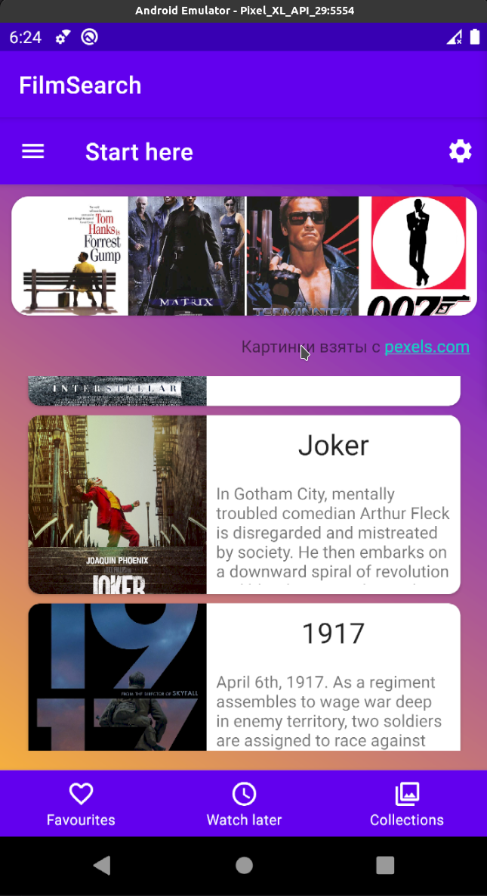
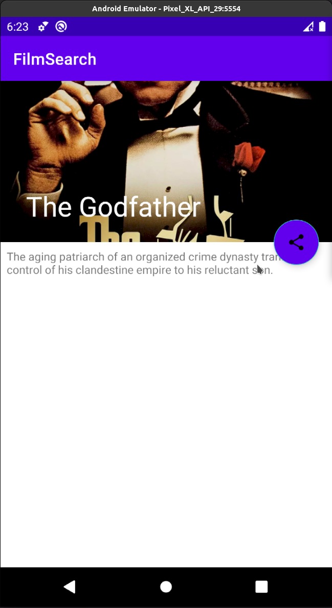

## Итоговый проект 

# Модуль 24

### Задание на этот раз следующее:

  - Нам нужно создать `RecyclerView` для главной страницы с фильмами (пока у нас нет данных по фильмам из сети, будем использовать *mock*-данные, то есть вручную создадим нашу БД с фильмами (7 - 10 штук)).
  - Сделаем заготовку под экран деталей фильма на основе `CoordinatorLayout`, там должен быть `Collapsing Toolbar` и «привязанные к нему» кнопки В избранное, Посмотреть позже и Поделиться.

### Дополнительное задание ✱:

  - Добавьте `DiffUtils` для нашего `RV`, на экране деталей добавьте `Snackbar` на нажатие кнопок В избранное и Посмотреть позже .

