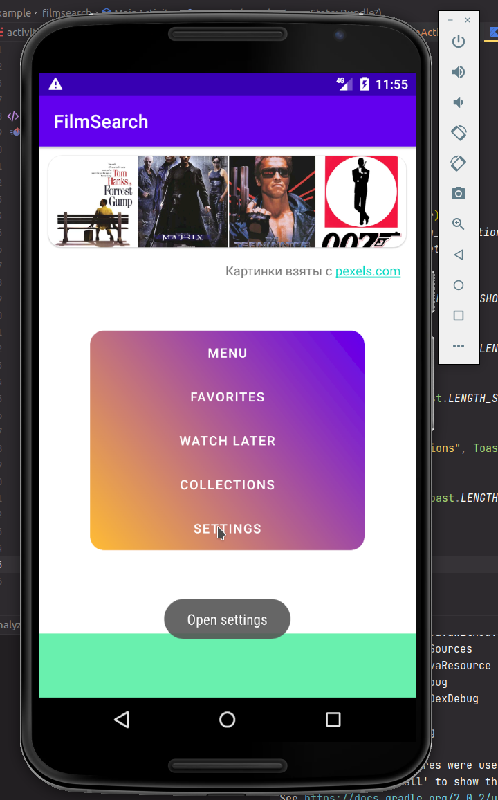
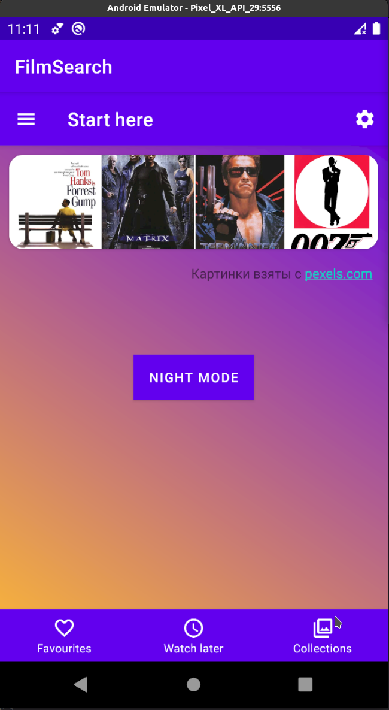

# Итоговый проект 

## Содержание

[1. Модуль 20](./readme.md#Модуль-20)

[1. Модуль 21](./readme.md#Модуль-21)

# Модуль 20

## Баллы за задание:

  - 1 балл за попытку;
  - 1 балл за выполненную работу;
  - 1 балл за задание под звездочкой.

## Задание

Итак, в этом практическом задании нужно сделать следующее:

  - Добавить кнопки меню;
  - Вставить постеры фильмов;
  - Вставить текстовые поля;
  - Применить Drawable для фонов;
  - Применить CardView для закругленных углов и левитации;
  - Добавьте на нажатие каждой кнопки функционал с показом Toast-сообщений.

:arrow_up: [к содержанию](readme.md#Содержание)

# Модуль 21

## Итак, проектная работа к этому модулю:

  - Сделать рефакторинг наших View на Material компоненты.
  - Добавить в приложение MaterialToolbar.
  - Перенести кнопки меню в Toolbar и панель навигации.

## Дополнительное условие✱:

  - Создайте темную/светлую тему приложения, используя квалификаторы.

:arrow_up: [к содержанию](readme.md#Содержание)