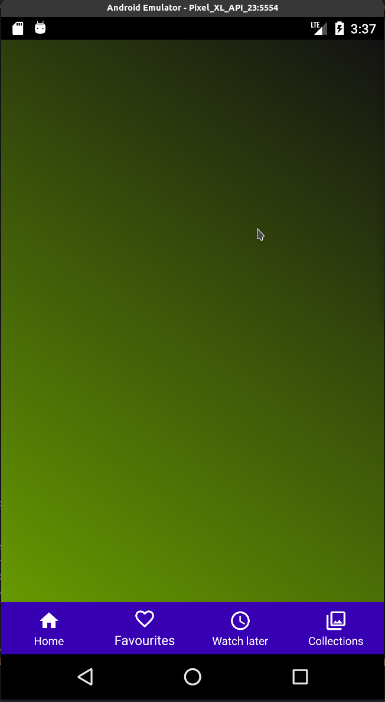

## Итоговый проект

# Модуль 29

### Задание:

- Сделать проявление фрагмента через Circular Reveal Animation.
- Добавить еще два фрагмента под «Посмотреть позже» и «Подборки», анимировать их появление.

### Дополнительное задание ✱:

- Сделать Splash Screen (экран приветствия) с векторной анимацией.

