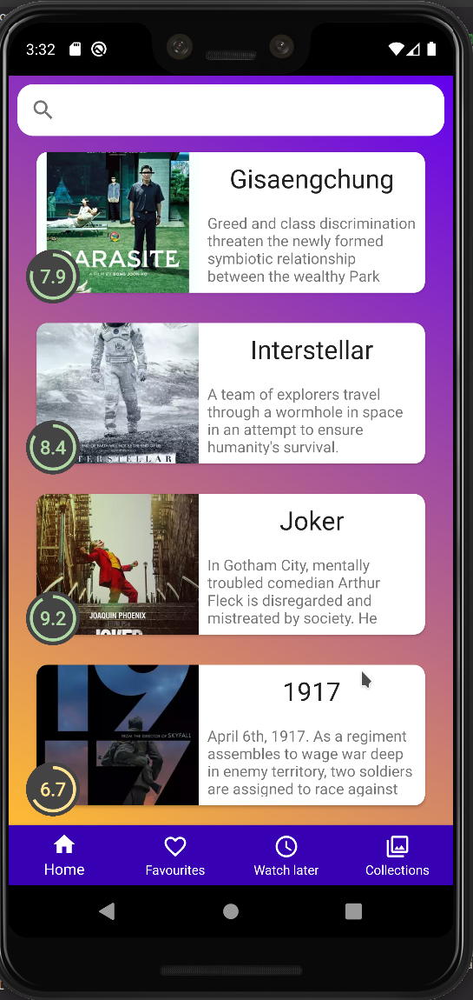

## Итоговый проект

# Модуль 31

### Задание:

- Кастомный прогресс-бар, который будет показывать, какой рейтинг у фильма.
- Мы должны применять толщину линии и прогресс из XML, а также устанавливать прогресс из кода, иначе как мы будем динамически менять рейтинг...

### Дополнительное задание ✱:

- Сделать появление прогресса анимированным

