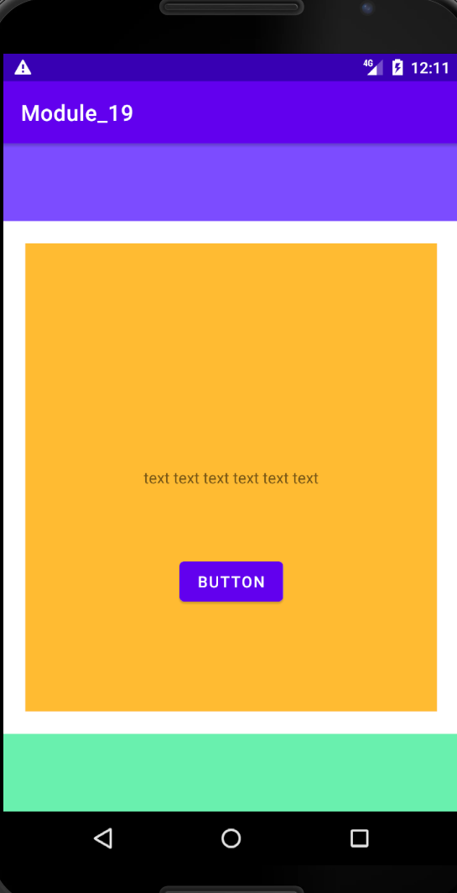

# 19.9. Проектная работа

## Создать контейнер под меню с кнопками

- Разместить контейнер по центру разметки.
- Переходим в `activity_main.xml`.
- Удаляем не нужный нам сейчас **TextView**.
- Добавляем контейнер под кнопки, наиболее подходящим будет **LinearLayout**, так как нам нужен вид списка.
- Задаем нашему **LinearLayout** вертикальный вид.
- Поскольку родительский элемент у нас **Constraint Layout**, задаем для контейнера с кнопками привязки (подумайте, к чему лучше привязаться).
- Задайте временный фон для контейнера, чтобы визуально легче понимать его расположение.
- Задайте временный размер (например **300 dp х 500 dp**).

## Создать контейнер под нижнее меню

- Разместите контейнер в нижней части экрана.
- Выберите тип контейнера, поскольку мы еще точно не знаем, что там будет, у нас же прототип, лучше выбрать **FrameLayout**.
- Ему надо задать высоту **70dp**, а по ширине он должен быть равен родителю.
- Задайте цвет фону.
- Привяжите его к низу экрана.

## Создать контейнер под верхнее меню

- Разместите контейнер в верхней части экрана.
- Аналогично нижнему контейнеру, сделайте верхний контейнер, изменив логику привязки.
- Задайте цвет фону.

#### **Задание со звездочкой** ⭐: сделайте верстку «резиновой», добейтесь того же эффекта, не задавая размеры контейнера (_использование margins_).

## За работу будут начисляться баллы:

- **1 балл** за попытку;
- **2 балла** за выполненную работу;
- **3 балла** за задание под звездочкой.

## Скриншоты:

